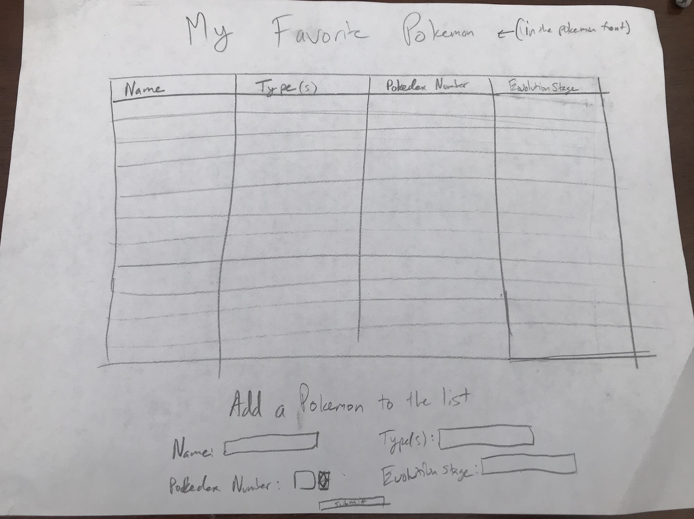
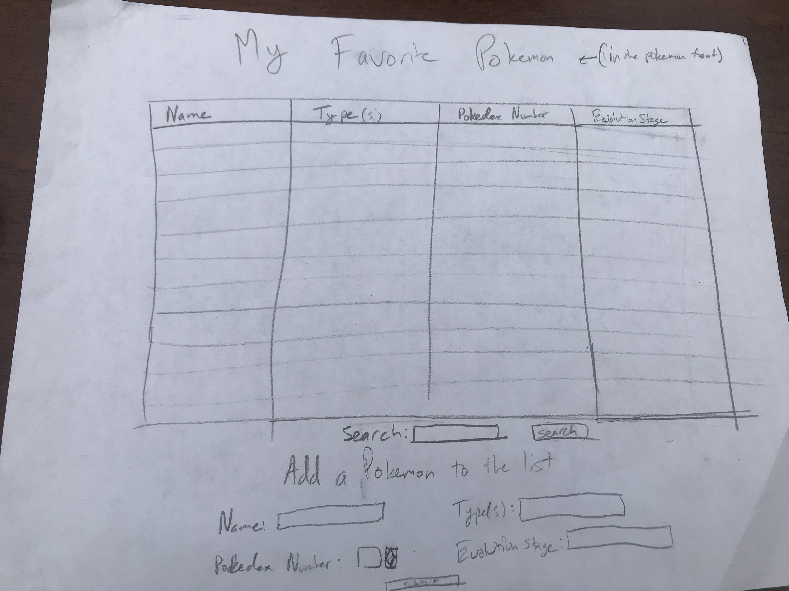
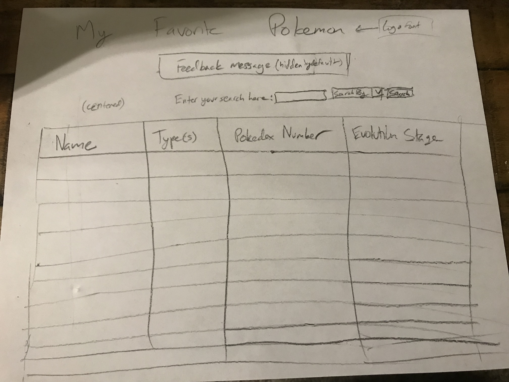
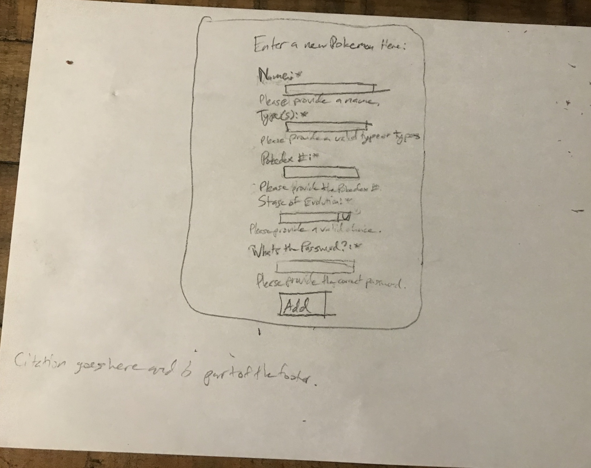

# Project 2: Design Journey

Your Name: Shea Murphy

**All images must be visible in Markdown Preview. No credit will be provided for images in your repository that are not properly linked in Markdown. Assume all file paths are case sensitive!**

# Project 2, Milestone 1 - Design, Plan, & Draft Website

## Describe your Catalog

My catalog will be a way to catalog my personal favorite Pokemon. This will include their type, pokedex number, name, and evolution stage (Basic, Stage 1, or Stage 2, or Legendary).

## Target Audiences

The target audience for this website will be Pokemon fans and collectors, and children who are very opinionated regarding Pokemon.

## Design Process

Since this project is centered around a table displaying database-held data, the design process will be fairly minimal. I will not need navigation as I will be using only one page, so my card sorting is that everything is on the index page. I plan to use colors like yellow and blue, as these are the colors of Pokemon's logo and I will be using a font generator to create a logo to supplement this color scheme. The logo at the top will look like this:

My first sketch is as follows:

It does not include searching, which I have not decided how or where to implement yet. It will either go above or below the table.

Once I considered my options, I added to my previous sketch to create the groundwork for a search function, and this will be my final design plan to start coding with. The final sketch can be found below:

From there, I began to code the website using HTML and PHP, before styling it with CSS. Once I had completed most of the websites physical structure and styling, I ended up deciding to make some structural changes to my website. I decided to put my search bar above my table rather than below in order to increase visibility. I also decided to ditch the design I had for the Pokemon Add form in favor of a single column for the sake of simplicity, but also because it looked much sleeker in my opinion. I sketched these changes before coding them, and then completing all back-end development that was still necessary as I had not learned some of the concepts until today. The sketches (with feedback added) can be viewed in the final design plan section below.

## Final Design Plan

## Templates

I will include a header template as well as a footer template that will be used to house the sites logo, and the appropriate citations regarding that logo and all content used on the site respectively. Though this website is only one page currently, using a template for each of these functions makes future pages easier to build if they are ever needed.

## Database Schema Design

[Describe the structure of your database. You may use words or a picture. A bulleted list is probably the simplest way to do this. Make sure you include constraints for each field.]

Table: pokemon
* field 0: id, is unique key for each entry, auto increments
* field 1: pname, Can be: any string
* field 2: ptype, Can be any combo of one or two of: Normal, Fighting, Flying, Poison, Ground, Rock, Bug, Ghost, Steel, Fire, Water, Grass, Electric, Psychic, Ice, Dragon, Dark, or Fairy (written "______, _____" if two)
* field 3: pokedex_num, Can be: an integer from 1 to 809
* field 4: evolution_stage, Can be: Basic, Stage 1, or Stage 2

## Database Query Plan

[Plan your database queries. You may use natural language, pseudocode, or SQL.]

1. All records

SELECT * FROM pokemon;

2. Search records

SELECT * FROM pokemon WHERE $category LIKE '%'||:search||'%';

3. Insert record

INSERT INTO pokemon(pname, ptype, pokedex_num, evolution_stage) VALUES (:pname, :ptype, :pokedex_num, :evolution_stage);

## Code Planning

Open the database:
$db = open_sqlite_db("secure/data.sqlite");

Print record function (prints all fields of record into the table):
function print_record($record) {
  <tr>
    <td><?php echo htmlspecialchars($record["pname"]);?></td>
    <td><?php echo htmlspecialchars($record["ptype"]);?></td>
    <td><?php echo htmlspecialchars($record["pokedex_num"]);?></td>
    <td><?php echo htmlspecialchars($record["evolution_stage"]);?></td>
  </tr>
}
(surround } and { in php tags)

Query of all fields:
$sql = "SELECT name, type, pokedex_num, evolution_stage FROM pokemon;";
$params = array();
$result = exec_sql_query($db, $sql, $params);

Print all:
$records = $result->fetchAll();
foreach ($records as $record) {
    print_record($record);
}

# Final Submission: Complete & Polished Website

## Reflection

In the process of completing this assignment, I learned how to accurately access information from and write to SQL databases using PHP. More specifically, I am now able to write HTML forms that take user input for both a search of the database and a database insertion, and using PHP/ HTML, present the user with feedback regarding their action, whether that means their action was successful () or unsuccessful (error messages)
